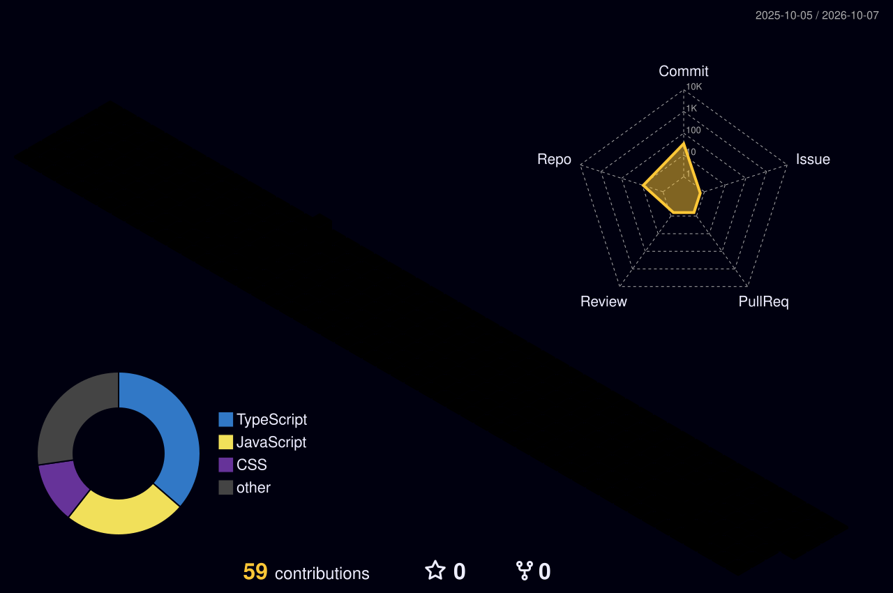

<!-- Animated waving header -->
<p align="center">
  
</p>

<!-- Typing animation -->
<p align="center">
  <a href="https://github.com/praveen-codes36">
    
  </a>
</p>

<p align="center">
  
  
  
</p>

> **I am not trying to look successful.**
> **I am trying to become someone worth remembering.**

---

## 👋 About Me

I'm **Praveen Kumar**, a B.Tech student who is learning, building, failing, improving, and moving forward.

```text
CURIOSITY → COURAGE → CONSISTENCY → CREATION → IMPACT
```

I don't see code as just syntax. I see it as: **an idea → a solution → a product → an opportunity → an impact.**

---

## 🛠️ Tech Stack

<p align="center">
  
</p>

| Area | What I'm working on |
|------|---------------------|
| 🧠 **Think** | Data Structures & Algorithms (C++) |
| 💻 **Build** | JavaScript · TypeScript · HTML · CSS · React |
| 🤖 **Explore** | Artificial Intelligence |
| 🚀 **Create** | Projects with real purpose |

---

## 🚀 Projects

| Project | Description | Stack |
|---------|-------------|-------|
| 🛡️ [**Prahari AI**](https://github.com/praveen-codes36/prahari-ai) | Exploring how AI can solve real-world problems, not just be "an AI project". |  |
| 🔐 [**Trustify**](https://github.com/praveen-codes36/Trustify) | Uses AI to cut through online noise and show what information you can trust, clearly, transparently and responsibly. |  |
| 🔑 [**Password Generator**](https://github.com/praveen-codes36/Password_generator_react) | A React-based password generator. |   |
| 🌐 [**Sigma Web Dev Course**](https://github.com/praveen-codes36/sigma-web-dev-course) | My web development learning journey. |  |
| ⚛️ [**react_pro**](https://github.com/praveen-codes36/react_pro) | React practice and experiments. |  |
| 🌱 [**learn-git**](https://github.com/praveen-codes36/learn-git) | A repo to learn Git fundamentals. |  |

---

## 📊 GitHub Analytics

<p align="center">
  
  
</p>

<p align="center">
  
</p>

### 📈 Contribution Activity Graph

<p align="center">
  
</p>

---

## 🧊 3D Contribution Graph

<p align="center">
  
</p>

> Generated automatically every day by the GitHub Action in `.github/workflows/profile-3d.yml`.

## 🐍 Contribution Snake

<p align="center">
  
</p>

## 🏆 Trophies

<p align="center">
  
</p>

---

## 🇮🇳 MATRIBHUMI — मातृभूमि

> **What if technology was built with responsibility?**

India has millions of problems, and millions of young minds. Somewhere between the two is an opportunity.

**BUILD FOR PEOPLE. BUILD WITH PURPOSE. BUILD FOR THE FUTURE.**

---

## 🎯 Currently

```text
STATUS: 🟢 LEARNING

├── Data Structures & Algorithms
├── Web Development
├── React
└── Artificial Intelligence

OBJECTIVE: Become better than yesterday.
```

## 📜 My Rules

1. Learn without pretending to know.
2. Build without waiting for perfection.
3. Ask questions without being ashamed.
4. Fail without losing direction.
5. Help people whenever possible.
6. Stay curious.
7. Keep going.

---

## 💬 For the person who found this profile

Nobody begins as an expert. The first project may be ugly, the first code may be bad, the first attempt may fail.

**START ANYWAY.**

---

<p align="center"><b>THIS IS NOT MY SUCCESS STORY. THIS IS THE FIRST PAGE OF IT.</b></p>

<p align="center"><code>while (alive) { learn(); build(); improve(); }</code></p>


